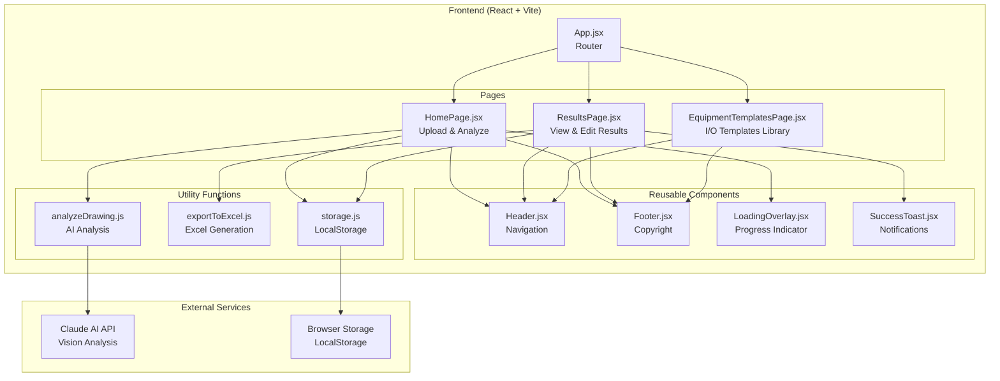
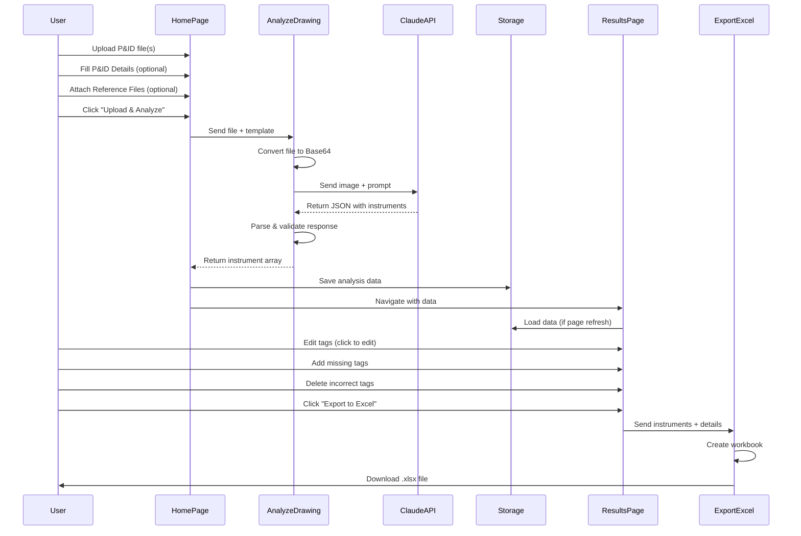
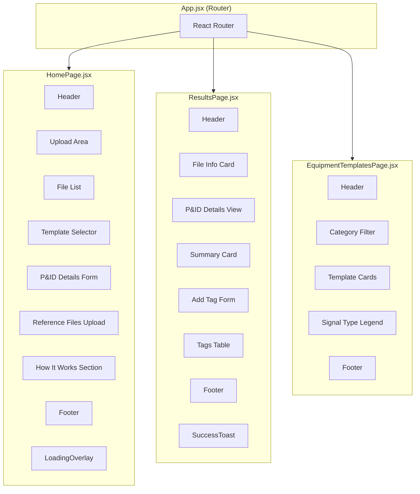
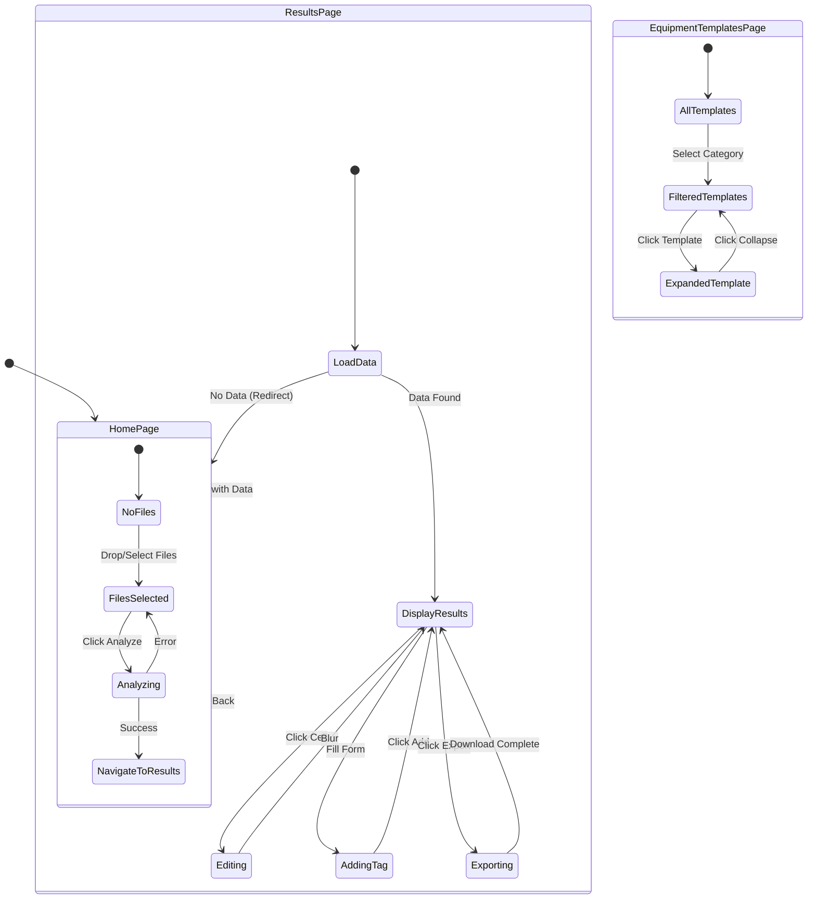
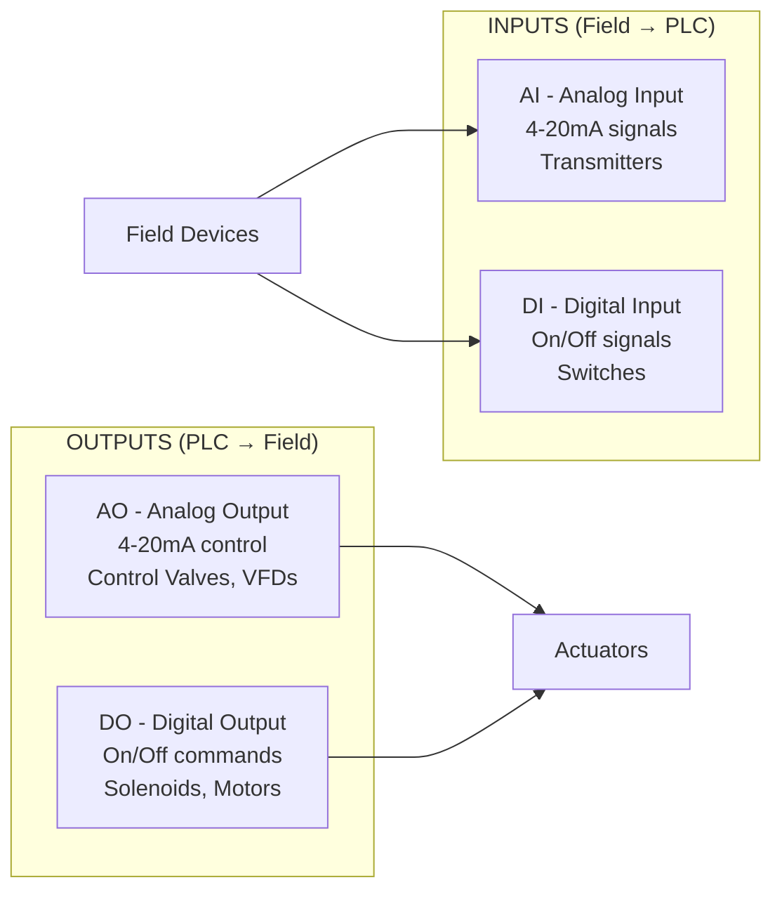

# InstruMap AI - System Architecture

## Overview

InstruMap AI is a web application that transforms P&ID (Piping and Instrumentation Diagram) drawings into I/O (Input/Output) lists. It uses AI to analyze engineering drawings and extract instrument tags automatically.

---

## System Architecture Diagram



---

## Data Flow Diagram



---

## Component Hierarchy



---

## State Management Flow



---

## File Structure

```
IO AI/
├── src/
│   ├── main.jsx              # Application entry point
│   ├── App.jsx               # Router configuration
│   ├── index.css             # Global styles + Tailwind
│   │
│   ├── pages/
│   │   ├── HomePage.jsx      # File upload & analysis
│   │   ├── ResultsPage.jsx   # Results display & editing
│   │   └── EquipmentTemplatesPage.jsx  # I/O templates
│   │
│   ├── components/
│   │   ├── Header.jsx        # Navigation header
│   │   ├── Footer.jsx        # Page footer
│   │   ├── LoadingOverlay.jsx # Loading spinner
│   │   └── SuccessToast.jsx  # Success notifications
│   │
│   └── utils/
│       ├── analyzeDrawing.js # Claude API integration
│       ├── exportToExcel.js  # XLSX file generation
│       └── storage.js        # LocalStorage helpers
│
├── docs/
│   ├── ARCHITECTURE.md       # This file
│   └── CODE_EXPLANATION.md   # Detailed code walkthrough
│
└── package.json
```

---

## Technology Stack

| Layer | Technology | Purpose |
|-------|------------|---------|
| Framework | React 19 | UI Components |
| Build Tool | Vite | Fast development & bundling |
| Styling | Tailwind CSS 4 | Utility-first CSS |
| Routing | React Router DOM | Page navigation |
| Icons | Lucide React | SVG icon library |
| Excel Export | SheetJS (xlsx) | Generate Excel files |
| AI Analysis | Claude API | Vision-based P&ID analysis |
| Storage | LocalStorage | Persist analysis between pages |

---

## Signal Types (ISA S5.1 Standard)



| Signal | Type | Direction | Examples |
|--------|------|-----------|----------|
| AI | Analog Input | Field → Control | LIT, PIT, FIT, TIT |
| DI | Digital Input | Field → Control | LSH, PSL, ZSO, ZSC |
| AO | Analog Output | Control → Field | FV, VFD Speed, Positioners |
| DO | Digital Output | Control → Field | XV, Motor Start, SOV |

---

## Key Features

1. **Multi-File Upload** - Process multiple P&ID drawings at once
2. **AI-Powered Analysis** - Claude vision model extracts instrument tags
3. **P&ID Details** - Store project info, drawing number, equipment list
4. **Reference Files** - Attach PDF/DWG files for future equipment matching
5. **Editable Results** - Click to edit any tag, add/remove instruments
6. **Excel Export** - Generate formatted I/O list with summary sheet
7. **Equipment Templates** - Reference library of standard equipment I/O
8. **Dark Mode** - Toggle between light and dark themes
